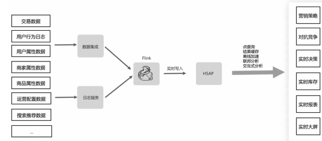

## 数据分层结构

### 问题1:为什么要进行数据分层？

1. 清晰数据结构，方便在出问题时进行血缘追踪    
2. 减少重复开发：开发一些通用的中间层数据    
3. 复杂问题简单化：复杂问题分解成多个步骤，每一层只处理单一步骤。修复问题从有问题的步骤修复    
4. 屏蔽原始数据的异常：不用改一次业务就重新接入数据（数据同步时有字段映射，原始数据改了加字段就可以）    
5. 空间换时间，对数据进行预处理    

### 问题2:数仓可以没有DWS层吗？
可以，在公司业务流程成熟之前，看数场景和指标体系不固定，可以只建到DWD层。架构这个东西，存在即是合理，只要合理的考虑层次的用途。

## 离线架构

### 数仓架构类型
1. Inmon，三范式消除冗余。各个业务部门自己建立各个数据集市，数据集市中落物理表，报表从数据集市出    


2. Kimball，数仓高粒度，使用灵活。由星型模式的维度表和事实表组成，数据集市是逻辑概念，不落物理表，可以选择建视图，或者干脆直接取数，因为数仓信息足够支持直接取数    

3. 混合数仓，由Inmon三范式数仓建立Kimball数仓，可以同时继承Inmon和Kimball优点：既可以消除冗余，又能提供多维度    


#### 结合工作经历
1. HangY使用Inmon，完全和这个一模一样    

2. FenT使用Inmon    
3. Kimball的星型模型和事实表    


### 离线建模
1. Inmon设计思路：自上而下，业务稳定，依靠经验    
	1. 看上游能给我们提供什么数据    
	2. 依靠经验把数据转化成表需求    
	3. ETL后，把数据放入3范式数据仓库    
	4. 从3范式数据仓库里取数，简单组合后形成数据各部门集市    
	5. 各数据集市给BI系统供数    
2. Kimball设计思路：自下而上，业务不稳定，建议不要一上来就搞大工程，先实现小目标，慢慢积累成数据仓库    
	1. 从下游业务数据分析需求出发，了解待解决问题的业务流程、维度、指标    
	2. 去上游业务系统数据源捞需要的数据（上游可能没有，得让他们提供）    
	3. 捞取的数据根据下游分析的目标，转变成维度表、事实表需求，为了方便分析，会做维度退化    
	4. 根据分析的领域不同，逐渐积累出一堆数据集市    
	5. 数据集市的集合在逻辑上的概念就是数据仓库    

由于ADS和DWS分界线不明，阿里新搞了一个MDS。    


## 实时架构
1. Lambda：在数据源和数仓之间新增一个消息队列（对数据源进行流式改造，即把数据发送到消息队列），实时计算消费消息队列，数据服务层完成离线和实时的合并。保存了T+1数据，实时计算重跑时比较友好。    

2. Kappa：去掉Lambda离线部分。    
	缺点：
	1. 消息中间件缓存的数据量和回溯数据有性能瓶颈。    
	2. 不同的实时流关联时，因为顺序问题而误抛。    
3. HSAP：Hybrid serving and analytical processing(服务分析一体化) 。本质也是Lambda，对实时和离线二次开发，统一封装。阿里云Hologres    


