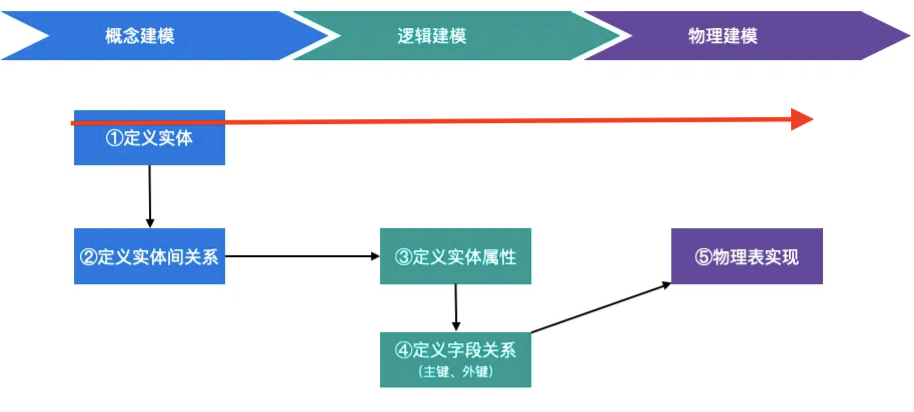
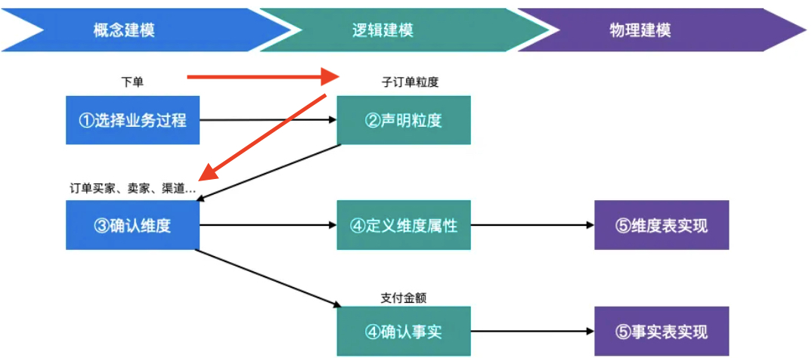
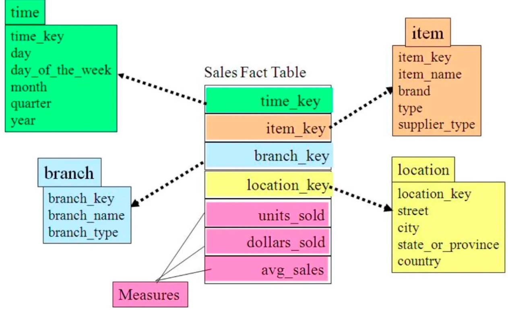
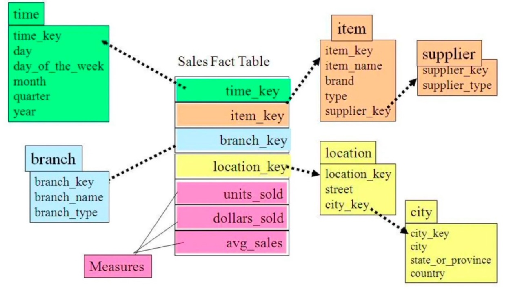
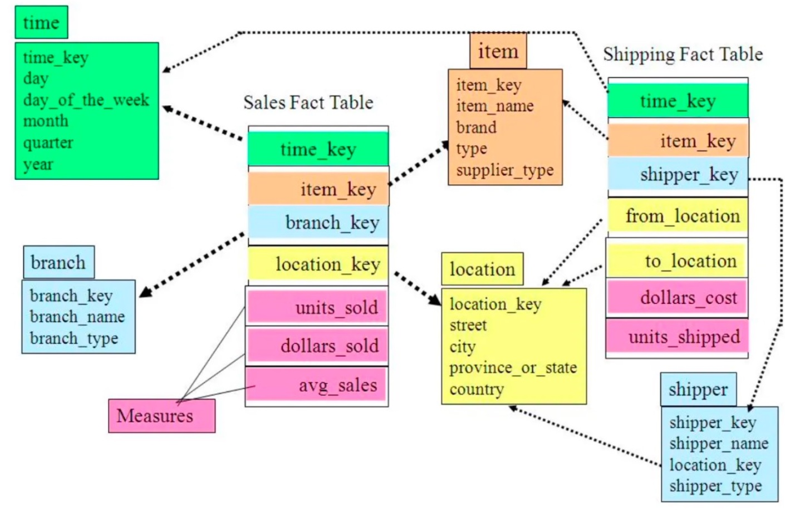

## 关系数据模型（Inmon）

### 构建流程


### 结构
| 表 | 列 | 行 |
| -------- | -------- | -------- |
| 关系 | 属性 | 元组 |
| 实体 | 字段 | 记录 |

超键：多列的联合标识表里行记录的唯一性    
候选键：超键子集，某一列已可以确定表行记录的唯一性。    
学号和姓名构成一个超键，如果学号本身可以保证唯一性，那学号就是一个候选键    

### 三范式3NF
3NF层层依赖，满足1NF才能满足2NF，满足2NF才能满足3NF    

1NF：表中行记录不可拆分        
2NF：表中非候选键必须依赖整个候选键集合，不能存在部分依赖    
3NF：表中非候选键不存在相互依赖    

<u>如果某张表是不符合3NF的，如何变成3NF</u>？    
把这张表拆成多张

## 维度数据模型（Kimball）

### 组成元素
事实：度量，值。如金额        
维度：事实的属性。如谁什么时间在哪买的    

维度模型按业务流程领域即主题域的建立，不同的主题域可能共享某些维度（共用1张维度表），为了提高数据操作的性能和数据一致性，需要<u>使用一致性维度（具有相同属性和内容的维度 ）</u>    

### 事实表
1. 事务事实表：事件的记录，每发生1次事件，表中就会插入1条记录。如下单记录、付款记录。    
2. 周期快照事实表：周期性的记录事情的事实或或历史状况的平均。如月末余额，本月销量。    
3. 累积快照事实表：统计流程节点运转效率，这种表有多个流程的关键时间。如订单表的下单时间、支付时间、发货时间。    

### 维度表
事实的属性    
1. 时间维度表：互联网一般不咋用。金融会用，如账期、财年。    
2. 地理维度表    
3. 产品维度表    
4. 人员维度表    
5. 范围维度表：什么样的区间定义成低中高    

代理键：维度表中设计一个单列。维度表本身生成的一个主键，用来映射业务的主键。实际用的较少。    

### 构建流程

1. 选择业务过程，确定事实表类型    
2. 声明粒度：业务最小的活动单元或不同维度的组合。    
3. 确认维度    
4. 确认事实（周期快照事实表中的全量型事实表快照、累积快照事实表可能没有这一步）    

<u>举个例子</u>
【业务过程】:下订单    
【粒度】:每笔订单(拆分为单个物品)     
【维度】:用户、商品、卖家、地域、渠道类型等(可供分析的角度)     
【事实/度量】:订单金额等(可用于分析的数据)     

【业务过程】:下订单    
【粒度】:每笔订单(拆分为单个物品)     
【维度】:用户、商品、卖家、地域、渠道类型等(可供分析的角度)     
【事实/度量】:订单金额等(可用于分析的数据)     

### 维度规范化
消除冗余，变得符合3NF的过程。<u>维度数据模型（Kimball）更倾向于非规范化</u>。    

<u>不做维度规范化原因</u>：    
1. 规范化会增加表的数量，代码更加复杂    
2. 查询性能，Join会走Shuffle，热点键存在会增加单个Reduce压力。    

问题：什么时候不做维度规范化？    
1. 多个维度共用某些通用属性时。如：省市区不做单独维表，而是和地区一起放在一个维表里。    
2. 多个维表较小组成1个为表较小时，可以使用Mapjoin。    

### 常见模型
#### 星型模型
有1个或多个事实表构成，每个事实表关联1层多个维表。维表不是规范化的，因为只有1层，尽量冗余多的信息，满足分析的需要。    
星型模型新增维度调整范围较大，灵活性不足。    

#### 雪花模型
对星型模型为表规范化处理，把冗余信息新建维表，形成雪花形状。Kimball逐渐变Inmon。    

#### 星座模型
多个星型模型的事实表共用维表自然形成了星座模型。企业中最常用。    


## Data Vault模型
### 组成
1. 中心表Hub：记录业务主键    
2. 链接表Link：记录业务关系    
3. 附属表Sat：记录业务描述。也叫卫星表    

Data Vault不区分数据在业务层面上正确与错误，它保留操作型系统的所有时间的所有数据，装载数据时不做数据验证、清洗等工作。符合数据湖理念。    

### 缺点：
看起来灵活，业务复杂且数据量大时，会产生很多卫星表，卫星表相当于Kimball的事实表，下游使用卫星表时，卫星表关联时属于大表关联大表，可能会产生瓶颈，且对集群计算能力的要求比较高。    
